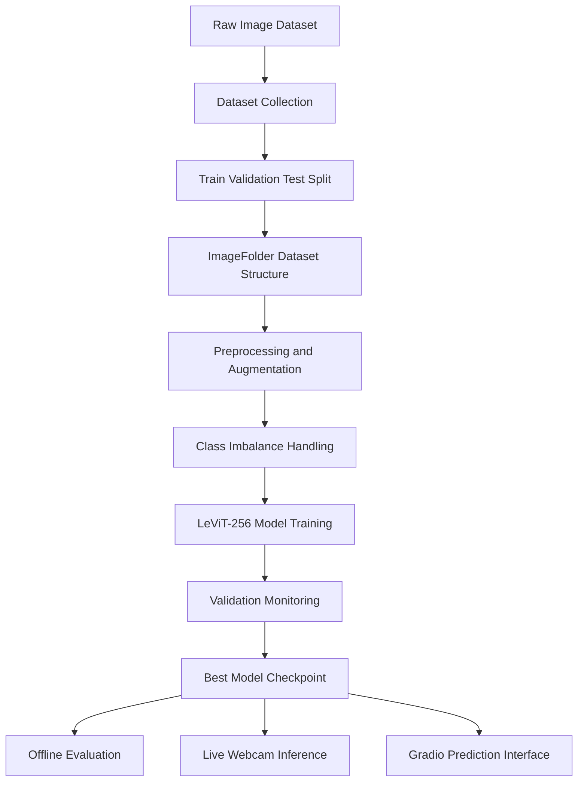
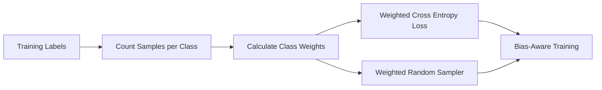
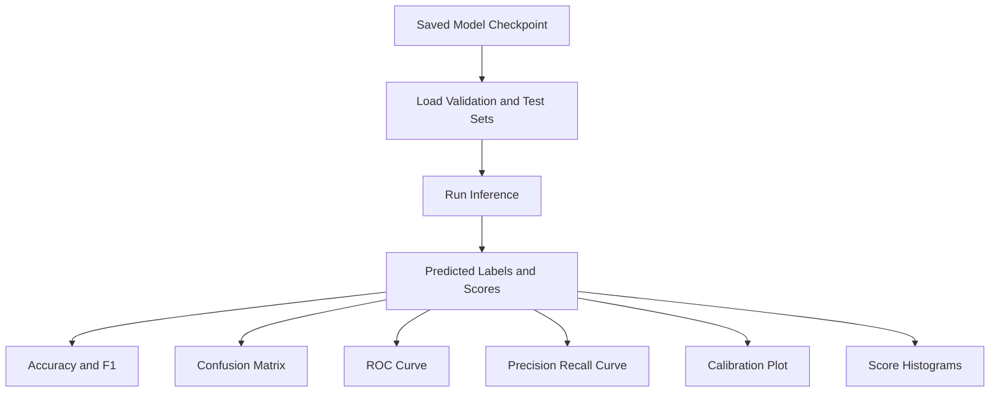

# LeViT-256 Gender Classification System

## Project Overview

This project presents a deep learning system for gender classification from face images using the LeViT-256 architecture.

The project follows a complete machine learning workflow.

It starts from dataset preparation and class balancing.

It continues with model training, validation, and testing.

It ends with offline evaluation, live webcam inference, and a Gradio-based user interface.

The system uses transfer learning with a pretrained LeViT-256 model from the `timm` library. The model is adapted for binary image classification with two output classes.

```text
Classes:
female
male
```

The project also includes steps to reduce class imbalance effects using class weighting and sampling techniques.

## Research Context

Gender classification from face images is a common computer vision task. It is used in many academic studies related to image classification, facial analysis, human-computer interaction, and applied artificial intelligence.

This project focuses on building a structured, reproducible, and evaluated classification pipeline.

The main academic focus is not only model training.

The project also considers:

- dataset organization
- preprocessing consistency
- class imbalance handling
- validation-based model selection
- evaluation using multiple metrics
- real-time inference
- deployment through a simple user interface

## Project Objectives

The main objectives of this project are:

- Build a gender classification model using LeViT-256
- Prepare image data in a clean ImageFolder structure
- Split the dataset into training, validation, and testing subsets
- Apply image preprocessing and augmentation
- Handle class imbalance using weighted loss and sampling
- Train and evaluate a pretrained transformer-based image model
- Save model checkpoints and performance artifacts
- Evaluate model behavior using classification metrics and plots
- Run live gender prediction using webcam input
- Provide a simple Gradio interface for image-based prediction

## System Workflow



## Methodology

### 1. Dataset Preparation

The dataset is collected from image folders containing male and female face images.

The code supports different folder naming formats such as:

```text
Train/Train/Female
Train/Train/Male
Validation/Validation/Female
Validation/Validation/Male
Test/Test/Female
Test/Test/Male
```

It also supports simpler structures such as:

```text
Train/Female
Train/Male
Validation/Female
Validation/Male
Test/Female
Test/Male
```

The dataset is converted into a clean PyTorch `ImageFolder` format.

```text
GENDER_IMAGEFOLDER/
│
├── train/
│   ├── female/
│   └── male/
│
├── val/
│   ├── female/
│   └── male/
│
└── test/
    ├── female/
    └── male/
```

The default split ratio is:

```text
Training: 70%
Validation: 15%
Testing: 15%
```

### 2. Data Loading

The project uses PyTorch `ImageFolder` datasets and `DataLoader` objects.

Training images are transformed with resizing, cropping, horizontal flipping, tensor conversion, and ImageNet normalization.

Validation and test images use conservative evaluation transformations.

### 3. Image Preprocessing

The model expects images with a fixed input size.

```text
Image size: 224 x 224
Normalization mean: [0.485, 0.456, 0.406]
Normalization std:  [0.229, 0.224, 0.225]
```

Training transformations include data augmentation.

Evaluation transformations avoid random changes to keep validation and test results stable.

### 4. Class Imbalance Handling

The project handles class imbalance using two methods.

#### Weighted loss

Class weights are calculated from the number of samples in each training class.

The weights are passed to `CrossEntropyLoss`.

This gives more importance to the minority class during training.

#### WeightedRandomSampler

The training loader can use a weighted sampler.

This increases the probability of sampling underrepresented classes.

The goal is to reduce bias caused by imbalanced training data.



## Model Architecture

The project uses LeViT-256.

LeViT is a hybrid vision architecture designed to combine convolutional efficiency with transformer-based representation learning.

In this project:

- pretrained LeViT-256 is loaded from `timm`
- the classification head is replaced
- the output layer is set to two classes
- the model is trained for gender classification

```text
Input Image
    ↓
Image Preprocessing
    ↓
LeViT-256 Backbone
    ↓
Classification Head
    ↓
Softmax Output
    ↓
female / male
```

## Training Strategy

The notebook contains two training strategies.

### Frozen training

A pretrained LeViT-256 model is used.

The model is trained while preserving pretrained knowledge.

The best model is selected based on validation macro F1-score.

Saved outputs include:

```text
best_frozen.pt
confusion_frozen.png
metrics_frozen.json
```

### Fine-tuning

The project also includes a CPU-friendly fine-tuning pipeline.

This pipeline freezes early parts of the model and trains higher layers and the classifier head.

The fine-tuned model is saved as:

```text
best_levit256.pt
```

The fine-tuning pipeline uses:

- AdamW optimizer
- learning rate warmup
- cosine learning rate schedule
- label smoothing
- gradient clipping
- early stopping
- validation macro F1-score for checkpoint selection

## Evaluation

The project includes a full evaluation pipeline for validation and test datasets.

The evaluation code calculates:

- Accuracy
- Macro F1-score
- Balanced accuracy
- Confusion matrix
- Classification report
- ROC curve
- Precision-recall curve
- Average precision score
- Calibration curve
- Score distribution histograms

These metrics provide a broader view of model behavior than accuracy alone.

Accuracy shows total correct predictions.

Macro F1-score gives equal importance to both classes.

Balanced accuracy helps when class distribution is not equal.

Confusion matrices show class-level errors.

ROC and precision-recall curves help inspect classification threshold behavior.

Calibration curves show whether the model confidence matches actual correctness.

## Evaluation Workflow



## Live Inference

The project includes live webcam inference using OpenCV.

The system:

- opens the webcam
- detects faces using Haar Cascade
- draws face boxes
- crops detected face regions
- applies preprocessing
- runs the LeViT-256 model
- produces gender probability scores
- saves prediction logs to CSV files

Output files include:

```text
pred_runs_gender.csv
pred_runs_gender_feedback.csv
```

The live inference module also supports simple user feedback collection.

This helps compare model prediction with user-confirmed labels.

## Gradio Interface

The project includes a Gradio interface for image-based prediction.

The user uploads an image.

The system returns prediction probabilities for:

```text
female
male
```

This makes the model easier to test without running webcam inference.

## Repository Structure

A recommended GitHub structure is shown below.

```text
levit256-gender-classification/
│
├── README.md
├── main.ipynb
├── requirements.txt
│
├── data/
│   └── README.md
│
├── artifacts/
│   ├── best_frozen.pt
│   ├── best_levit256.pt
│   ├── metrics_frozen.json
│   ├── metrics_levit256.json
│   └── confusion_matrix.png
│
├── outputs/
│   ├── pred_runs_gender.csv
│   └── pred_runs_gender_feedback.csv
│
└── figures/
    ├── confusion_matrix.png
    ├── roc_curve.png
    ├── precision_recall_curve.png
    ├── calibration_curve.png
    └── score_histograms.png
```

## Installation

### 1. Clone the repository

```bash
git clone https://github.com/your-username/levit256-gender-classification.git
cd levit256-gender-classification
```

### 2. Create a virtual environment

```bash
python -m venv venv
```

Activate it on Windows.

```bash
venv\Scripts\activate
```

Activate it on macOS or Linux.

```bash
source venv/bin/activate
```

### 3. Install dependencies

```bash
pip install -r requirements.txt
```

If you do not have a `requirements.txt` file yet, use:

```bash
pip install torch torchvision timm scikit-learn matplotlib pandas numpy opencv-python gradio pillow
```

## Requirements

Recommended `requirements.txt`:

```text
torch
torchvision
timm
scikit-learn
matplotlib
pandas
numpy
opencv-python
gradio
pillow
ipython
```

## Dataset Format

Place your dataset in the following format:

```text
GENDER_IMAGEFOLDER/
│
├── train/
│   ├── female/
│   └── male/
│
├── val/
│   ├── female/
│   └── male/
│
└── test/
    ├── female/
    └── male/
```

Each class folder should contain image files.

Supported image extensions include:

```text
.jpg
.jpeg
.png
.bmp
.webp
```

## How to Run the Project

### 1. Prepare the dataset

Run the dataset preparation cells in `main.ipynb`.

This creates the final ImageFolder dataset structure.

### 2. Check dataset statistics

Run the dataset checking section.

It prints:

- class names
- sample count per split
- sample count per class
- train, validation, and test ratios
- calculated class weights

### 3. Train the model

Run the LeViT-256 training section.

The training process saves:

```text
best_frozen.pt
metrics_frozen.json
confusion_frozen.png
```

For fine-tuning, run the fine-tuning section.

The fine-tuned model is saved as:

```text
best_levit256.pt
```

### 4. Evaluate the model

Run the evaluation section.

The notebook generates metrics and plots for validation and test data.

### 5. Run live webcam prediction

Run the live inference section.

Press `q` to stop the webcam window.

### 6. Run the Gradio interface

Run the Gradio section.

A local web interface will open where you can upload images and test predictions.

## Main Files and Components

### Dataset preparation

Responsible for:

- reading image files
- collecting male and female samples
- creating train, validation, and test splits
- saving images in ImageFolder format

### Data loaders

Responsible for:

- loading image datasets
- applying transformations
- creating PyTorch DataLoaders
- calculating class weights
- applying weighted sampling

### Training module

Responsible for:

- loading LeViT-256
- replacing the classifier head
- training the model
- validating each epoch
- saving the best checkpoint

### Evaluation module

Responsible for:

- loading saved checkpoints
- running inference on validation and test sets
- generating metrics
- plotting diagnostic figures

### Live inference module

Responsible for:

- webcam capture
- face detection
- prediction
- overlay display
- saving prediction logs

### Gradio module

Responsible for:

- image upload
- preprocessing
- model inference
- probability output

## Output Artifacts

The project produces several output files.

```text
best_frozen.pt
best_levit256.pt
metrics_frozen.json
metrics_levit256.json
confusion_frozen.png
pred_runs_gender.csv
pred_runs_gender_feedback.csv
```

These files support model reproducibility, analysis, and reporting.

## Example Metrics Section

After training, add your actual results here.

```text
Validation Accuracy:
Validation Macro F1:

Test Accuracy:
Test Macro F1:
Test Balanced Accuracy:
```

Example table format:

| Model | Split | Accuracy | Macro F1 | Balanced Accuracy |
|---|---:|---:|---:|---:|
| LeViT-256 Frozen | Validation | Add value | Add value | Add value |
| LeViT-256 Frozen | Test | Add value | Add value | Add value |
| LeViT-256 Fine-Tuned | Validation | Add value | Add value | Add value |
| LeViT-256 Fine-Tuned | Test | Add value | Add value | Add value |

## Academic Contribution

This project provides a complete applied deep learning pipeline for binary face image classification.

The contribution is not limited to training a model.

It includes:

- structured dataset preparation
- reproducible preprocessing
- imbalance-aware training
- transformer-based computer vision modeling
- validation-based checkpoint selection
- multi-metric performance evaluation
- live camera testing
- deployment-ready interface using Gradio

## Limitations

The model performance depends on dataset quality.

Possible limitations include:

- class imbalance
- low image quality
- lighting variation
- face angle variation
- age distribution differences
- dataset bias
- limited generalization to unseen domains

The project includes imbalance handling, but this does not remove all possible bias.

A stronger future version should evaluate performance across age groups, lighting conditions, image sources, and demographic subgroups.

## Ethical Considerations

Gender classification from images can raise ethical concerns.

This project should be used for academic and educational purposes.

Any practical use should consider:

- consent
- privacy
- dataset bias
- fairness
- transparency
- data security
- model limitations

The system should not be used for decisions that affect people without proper ethical review and human oversight.

## Future Work

Possible future improvements include:

- add Grad-CAM visual explanations
- compare LeViT-256 with EfficientNet and ResNet
- add fairness evaluation across demographic groups
- improve face alignment before prediction
- add confidence threshold calibration
- export the model to ONNX
- build a Streamlit or FastAPI deployment version
- add automated experiment tracking
- add unit tests for preprocessing and inference
- improve dataset documentation

## Citation Style

If this project is used in academic work, cite the main tools and libraries used.

Suggested citation text:

```text
This project used PyTorch and torchvision for deep learning development, timm for the LeViT-256 pretrained model, scikit-learn for evaluation metrics, OpenCV for live image capture and face detection, and Gradio for the user interface.
```

## Author

Add your name here.

```text
Name: Your Name
Field: Artificial Intelligence / Computer Vision
Project Type: Academic Deep Learning Project
```

## License

Add your preferred license.

Recommended for academic GitHub projects:

```text
MIT License
```

## Summary

This repository implements a complete gender classification system based on LeViT-256.

It includes dataset preparation, training, evaluation, live inference, and user interface deployment.

The project is structured to support academic presentation, reproducibility, and future research development.
